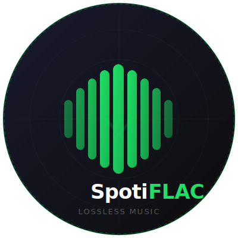
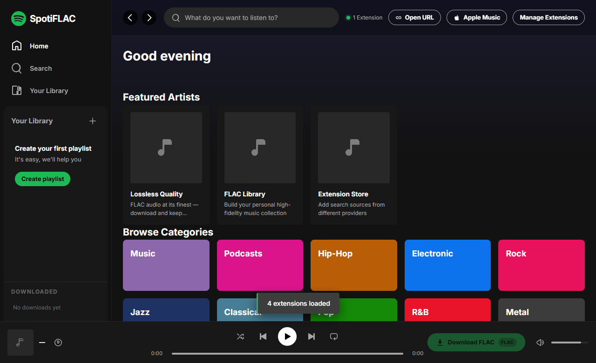
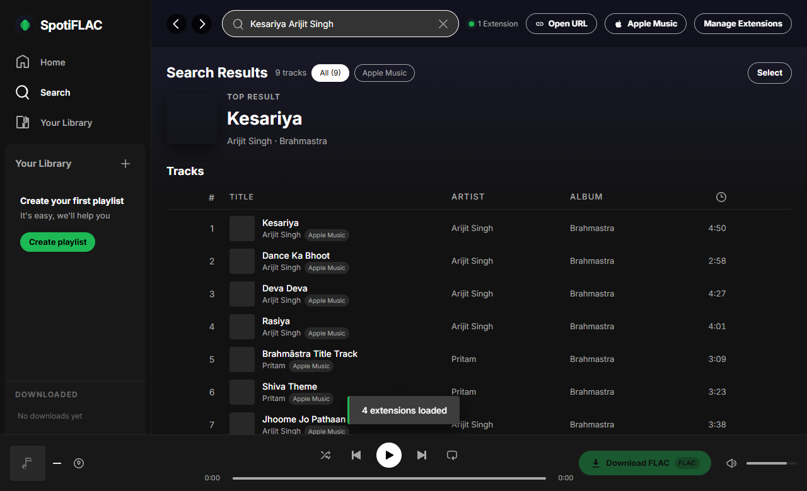
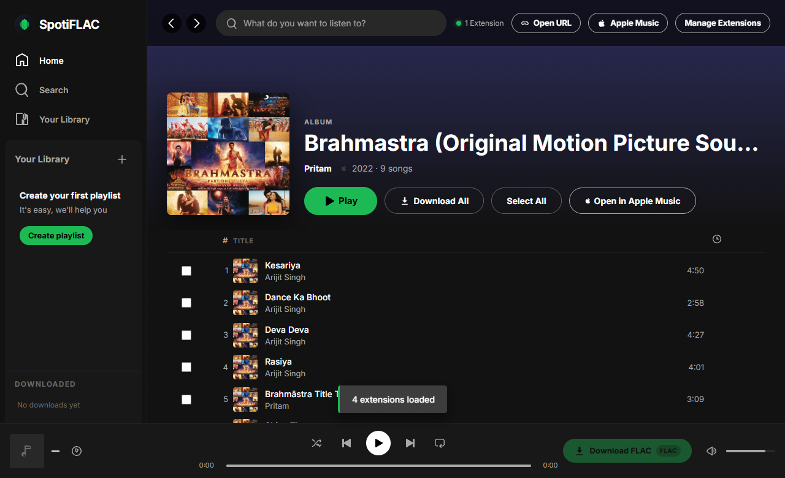

<div align="center">

<br/>



<br/>

**Download true lossless FLAC music from Apple Music, YouTube Music, and more.**  
Organized by album, artist, or playlist. No browser prompts. No compression.

<br/>

[](https://github.com/khalidbashir89-commits/spotiflac/releases)
[](https://github.com/khalidbashir89-commits/spotiflac/releases/latest)
[](LICENSE)
[](https://electronjs.org)
[](https://nodejs.org)

<br/>

[**⬇️ Download for Windows**](https://github.com/khalidbashir89-commits/spotiflac/releases/latest) · [**🌐 Website**](https://khalidbashir89-commits.github.io/spotiflac/) · [**🐛 Report a Bug**](https://github.com/khalidbashir89-commits/spotiflac/issues)

<br/>

</div>

---

## ✨ What is SpotiFLAC?

SpotiFLAC is a **desktop music downloader** that fetches true lossless audio from Apple Music and other sources, converts it to FLAC, and saves it in a clean folder structure on your machine — all without touching a browser download dialog.

You search, browse an album or playlist, tick the tracks you want, and click download. Done. The files land in `Downloads/FLAC Music/{Album Name}/` already named and organized.

---

## 🎯 Features

### 🎵 Lossless Audio Quality
| Source | Format | Quality |
|--------|--------|---------|
| Apple Music | ALAC → FLAC | 16-bit/44.1kHz CD Lossless or 24-bit/192kHz Hi-Res |
| YouTube Music | AAC → FLAC | Best available quality via yt-dlp |
| Deezer | FLAC | CD Lossless — requires HiFi subscription + ARL token |
| Spotify | YouTube → FLAC | Via spotDL — not lossless, YouTube-sourced |
| SoundCloud | AAC → FLAC | Via yt-dlp |
| JioSaavn | MP4 → FLAC | 320kbps |

### 📁 Organized Downloads
Files are saved directly to your disk — no "Save As" dialogs, no ZIP files to unpack:
```
Downloads/
└── FLAC Music/
    ├── Dune Part Two OST/
    │   ├── 01 - Hans Zimmer - Beginnings Are Such Delicate Times.flac
    │   ├── 02 - Hans Zimmer - The Arrakeen.flac
    │   └── ...
    ├── Telugu Tamil/              ← playlist folder
    │   ├── Anirudh Ravichander - Rowdy Baby.flac
    │   └── ...
    └── Singles/                   ← from search results
        └── Artist - Track.flac
```

### 🔍 Search & Browse
- **Search** across all enabled sources at once
- **Paste any Apple Music URL** — album, artist, playlist, or single song
- **Browse artists**: see all albums, click into any one
- **Full pagination** — playlists with 500+ songs load completely (not just first 100)
- **Region-aware** — uses the correct storefront from the URL (`/in/`, `/us/`, `/gb/`, etc.)

### ✅ Select & Batch Download
- Checkbox every row for granular selection
- **Select All / Deselect All** toggle
- Live progress toast: `Saving 47/501: Song Name…`
- Already-downloaded files are skipped automatically

### 🎧 Built-in Player
- Play any track before downloading
- Queue management — add songs from search or collection
- Scrubber, volume, and playback speed controls

### 🧩 Extension System
SpotiFLAC is built around pluggable source extensions. Each extension is a single `.js` file dropped into the `extensions/` folder. Enable, disable, or install new ones from inside the app — no restart needed.

---

## 📸 Screenshots

<div align="center">

| Home | Search Results |
|------|----------------|
|  |  |

<br/>

**Album / Collection view — select tracks and download as FLAC**



</div>

---

## 📦 Installation

### Option A — Desktop App (recommended)

1. Go to [**Releases**](https://github.com/khalidbashir89-commits/spotiflac/releases/latest)
2. Download `SpotiFLAC-v1.0.0-win-x64.zip`
3. Extract the ZIP anywhere on your machine
4. Double-click **`SpotiFLAC.exe`**

The app opens in its own window. No browser, no terminal.

### Option B — Run from source

```bash
git clone https://github.com/khalidbashir89-commits/spotiflac.git
cd spotiflac
npm install
npm start          # opens at http://localhost:3000
```

---

## ⚙️ Prerequisites

SpotiFLAC handles the UI and orchestration. The actual audio downloading and conversion relies on external CLI tools — install only the ones for the sources you use:

**Always required**

| Tool | Purpose | Install |
|------|---------|---------|
| **Python 3.9+** | Required by gamdl, deemix, spotDL | [python.org](https://python.org/downloads) |
| **ffmpeg** | Audio conversion (all sources) | [ffmpeg.org](https://ffmpeg.org/download.html) |
| **yt-dlp** | YouTube Music + SoundCloud | `pip install yt-dlp` |

**Per source (install what you need)**

| Tool | Source | Install |
|------|--------|---------|
| **gamdl** | Apple Music (lossless ALAC) | `pip install gamdl` |
| **deemix** | Deezer (FLAC, HiFi sub required) | `pip install deemix` |
| **spotDL** | Spotify (YouTube-sourced FLAC) | `pip install spotdl` |

> **ffmpeg tip:** Place `ffmpeg.exe` in `C:\Users\<you>\.spotiflac\` and SpotiFLAC will find it automatically — no PATH changes needed.

---

## 🍎 Apple Music Setup

Apple Music requires a one-time cookie setup to authenticate downloads.

<details>
<summary><strong>Click to expand setup steps</strong></summary>

<br/>

**Step 1 — Log in to Apple Music in your browser**

Open Chrome or Edge and go to [music.apple.com](https://music.apple.com). Sign in with your Apple ID (requires an active Apple Music subscription).

**Step 2 — Export cookies**

Install the [**Get cookies.txt LOCALLY**](https://chrome.google.com/webstore/detail/get-cookiestxt-locally/cclelndahbckbenkjhflpdbgdldlbecc) extension. Click the extension icon while on `music.apple.com` and export the cookies as a `.txt` file.

**Step 3 — Upload to SpotiFLAC**

Open SpotiFLAC, click the **Apple Music Setup** button (or navigate to `/apple-setup`), and drag your `cookies.txt` file onto the upload zone.

That's it. Cookies are stored locally at `C:\Users\<you>\.spotiflac\apple-music-cookies.txt` and never leave your machine.

> **Cookies expire** when you log out of Apple Music. If downloads stop working, re-export and re-upload.

</details>

---

## 🚀 Usage

### Downloading a single song
1. Type the song name in the search bar
2. Click the **⋯** menu next to the result → **Download FLAC**
3. File appears in `Downloads/FLAC Music/Singles/`

### Downloading an album or playlist
1. Paste the Apple Music URL into the search bar:
   ```
   https://music.apple.com/in/playlist/telugu-tamil/pl.u-6mo4l9LHBPlRzVq
   https://music.apple.com/us/album/dune-part-two/1724120256
   ```
2. The full collection loads with artwork and track list
3. Use checkboxes to select specific songs — or click **Select All**
4. Click **Download Selected**

### Browsing an artist
1. Click **Browse Artist** in the ⋯ menu of any track
2. Artist page shows top songs + all albums
3. Click any album to open it, then select and download

---

## 🧩 Extension System

Each music source is a self-contained extension file in the `extensions/` folder.

```
extensions/
├── applemusic.js       ← Apple Music (ALAC lossless)
├── ytmusic.js          ← YouTube Music
├── jiosaavn.js         ← JioSaavn
├── Extension.js        ← Template for writing your own
└── _EXTENSION_GUIDE.md ← Full guide
```

### Enabling / disabling extensions
Open the app → **Extensions** panel → toggle any source on or off. Changes take effect immediately.

### Writing your own extension
An extension needs to export a class with a `name`, optional `search(query)`, `resolve(trackId)`, and optionally `getAlbum(id)`, `getArtist(id)`, `getPlaylist(id)` methods. See [`extensions/Extension.js`](extensions/Extension.js) for the full interface and [`extensions/_EXTENSION_GUIDE.md`](extensions/_EXTENSION_GUIDE.md) for a walkthrough.

```js
class MySourceExtension {
  constructor() {
    this.name = 'My Source';
    this.capabilities = ['search', 'download'];
  }

  async search(query) {
    // return array of track objects
  }

  async resolve(trackId) {
    // return { streamUrl, downloadUrl, format, lossless }
  }
}

module.exports = MySourceExtension;
```

---

## 🗂️ Project Structure

```
spotiflac/
├── server.js                  ← Express API server + download logic
├── electron-main.js           ← Electron desktop wrapper
├── extensions/                ← Source plugins (one file per source)
├── server/
│   ├── extensionManager.js    ← Loads, enables/disables extensions
│   └── registry.js            ← Fetches extension list from GitHub
└── public/                    ← Frontend (vanilla JS ES modules)
    ├── index.html
    ├── styles.css
    └── modules/
        ├── search.js           ← Search UI + context menu
        ├── collection.js       ← Album / artist / playlist pages
        ├── player.js           ← Audio player
        └── ui.js               ← Shared UI helpers
```

---

## 🔧 Building the Desktop App

```bash
# Install dependencies
npm install

# Run in Electron (dev)
npm run electron

# Build Windows exe
npm run build
# Output: dist/win-unpacked/SpotiFLAC.exe
```

> Requires Developer Mode enabled in Windows Settings → Privacy & Security → For Developers (needed for the NSIS code-signing step). Alternatively, the `dist/win-unpacked/` folder produced without Developer Mode is fully functional — just run `SpotiFLAC.exe` directly from that folder.

---

## ❓ FAQ

<details>
<summary><strong>Why does it only show 100 songs from my playlist?</strong></summary>

This was a known issue — fixed in v1.0.0. SpotiFLAC now paginates through all pages and uses the correct regional storefront from your URL. A 501-song playlist loads all 501 tracks.

</details>

<details>
<summary><strong>Is this legal?</strong></summary>

SpotiFLAC downloads music you have access to via an active Apple Music subscription. Whether downloading for offline personal use is permitted depends on Apple's terms of service and the laws in your country. Use responsibly.

</details>

<details>
<summary><strong>The download button does nothing / fails</strong></summary>

1. Check that Python, gamdl, and ffmpeg are all installed and accessible
2. Check that your Apple Music cookies are still valid — re-export if needed (`/apple-setup`)
3. Open the browser dev tools console (F12) for the specific error message

</details>

<details>
<summary><strong>Can I add Spotify or Tidal?</strong></summary>

Those platforms use heavier DRM that isn't supported by current open-source tools. The extension system is ready for them if a compatible backend exists.

</details>

---

## 📄 License

ISC — see [LICENSE](LICENSE)

---

<div align="center">

Built with [Electron](https://electronjs.org) · [Express](https://expressjs.com) · [gamdl](https://github.com/glomatico/gamdl) · [yt-dlp](https://github.com/yt-dlp/yt-dlp) · [ffmpeg](https://ffmpeg.org)

<br/>

**[⬇️ Download](https://github.com/khalidbashir89-commits/spotiflac/releases/latest)** · **[🌐 Website](https://khalidbashir89-commits.github.io/spotiflac/)** · **[🐛 Issues](https://github.com/khalidbashir89-commits/spotiflac/issues)**

</div>
